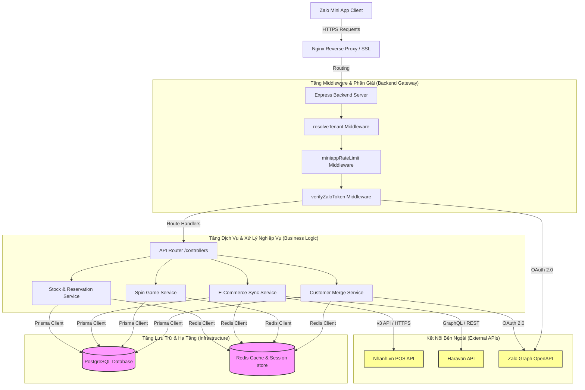
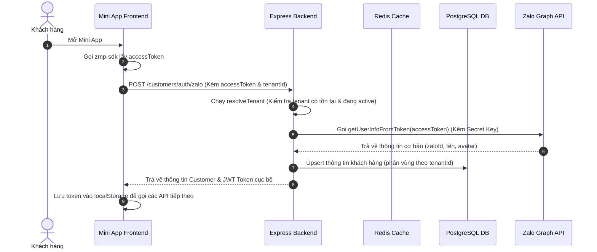
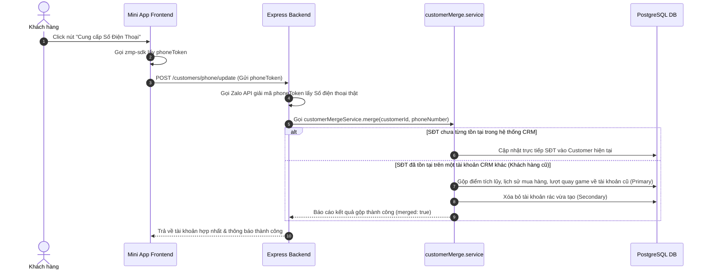

# 📘 TÀI LIỆU KIẾN TRÚC KỸ THUẬT & LUỒNG DỮ LIỆU ZALO MINI APP
> **Trạng thái thẩm định:** Bản nháp kỹ thuật (Technical Blueprint)  
> **Cấp độ kiến trúc:** Enterprise Multi-Tenant Production Ready  
> **Dự án:** Zalo Mini App (Tích hợp CRM, E-Commerce Nhanh.vn/Haravan & Gamification)

Tài liệu này cung cấp cái nhìn chi tiết nhất về toàn bộ cấu trúc mã nguồn, kiến trúc hệ thống, luồng dữ liệu nghiệp vụ (Runtime Flows), các điểm mạnh kiến trúc đã đạt chuẩn **Production** và danh sách tối ưu hóa bảo mật/hiệu năng trước khi chính thức Go-Live.

---

## 🗺️ 1. Sơ đồ Kiến trúc Hệ thống (System Architecture)

Dưới đây là mô hình phân tầng hoạt động của hệ thống từ Zalo Mini App client đến hạ tầng Backend đa doanh nghiệp (Multi-tenant):



---

## 📂 2. Toàn bộ Cấu trúc Thư mục (Project Directory Tree)

Dự án được tổ chức theo mô hình **Monorepo thu nhỏ** gồm 2 phần độc lập: `frontend` (React + Vite + ZMP SDK) và `backend` (Express + TypeScript + Prisma + Redis).

### 🖥️ A. Cấu trúc Frontend (`/frontend`)
```yaml
frontend/
├── package.json               # Cấu hình dependencies (React 18, Tailwind v4, ZMP SDK)
├── vite.config.ts             # Cấu hình Vite & Tailwind v4 compiler
├── tailwind.config.js         # Cấu hình token styles (phối hợp Tailwind v4)
├── app-config.json            # File cấu hình bắt buộc của Zalo Mini App (quy định routing, titlebar, app ID)
├── zmp-cli.json               # File cấu hình deploy/đóng gói của Zalo CLI
├── www/                       # Thư mục build đầu ra (chứa index.html, index.js, index.css)
└── src/
    ├── main.tsx               # Điểm khởi đầu của ứng dụng React
    ├── App.tsx                # Bộ định tuyến cấp cao (ZMP Router) & Cấu hình Providers
    ├── lib/
    │   └── api.ts             # API Client wrapper (tự động đính kèm Token và Bypass-Tunnel header)
    ├── context/
    │   └── AuthContext.tsx    # Quản lý trạng thái Đăng nhập Zalo, AccessToken, và Cơ chế mock dự phòng
    ├── hooks/                 # Custom React Hooks (useCart, useDebounce...)
    ├── components/            # UI Components dùng chung (Header, Navigation, SpinWheel, PopupModal)
    ├── css/
    │   └── app.css            # Styles tùy biến & Cấu trúc nền tảng Tailwind
    └── pages/                 # Danh sách màn hình chức năng:
        ├── Home.tsx           # Trang chủ hài hòa (Banners, Danh mục, Sản phẩm E-com, Vòng quay banner)
        ├── Profile.tsx        # Trang thông tin cá nhân & Lịch sử nhận quà
        ├── SpinGamePage.tsx   # Trang Vòng quay may mắn (tích hợp quay thưởng thời gian thực)
        ├── CartPage.tsx       # Giỏ hàng & Xử lý đặt đơn POS / E-com
        └── OrderHistory.tsx   # Lịch sử đơn hàng POS & trạng thái giao hàng
```

### ⚙️ B. Cấu trúc Backend (`/backend`)
```yaml
backend/
├── package.json               # Cấu hình runtime (NodeJS ES Modules, Prisma, tsx)
├── tsconfig.json              # Trình biên dịch TypeScript cấu hình strict mode
├── .env                       # Lưu trữ biến môi trường (Database URL, Redis connection, Zalo App Secret)
├── prisma/
│   └── schema.prisma          # Định nghĩa cấu trúc DB (PostgreSQL) & Tenant relations
└── src/
    ├── index.ts               # Điểm khởi chạy Server (Express, CORS setup, Graceful Shutdown)
    ├── types.ts               # Định nghĩa kiểu dữ liệu mở rộng cho Express Request (MiniappRequest)
    ├── lib/                   # Thư viện và công cụ dùng chung:
    │   ├── prisma.ts          # Singleton Prisma Client (Tách biệt Client thường và Client Raw không Tenant)
    │   ├── redis.ts           # Singleton Redis Connection
    │   ├── zaloApi.ts         # Wrapper gọi Zalo Graph API (Lấy SĐT, profile, refresh token OA)
    │   ├── stockManager.ts    # Logic khóa giữ tồn kho (Stock Reservation)
    │   ├── phone.helper.ts    # Chuẩn hóa định dạng số điện thoại Việt Nam (+84, 09x)
    │   └── response.helper.ts # Chuẩn hóa cấu trúc JSON trả về (successResponse, errorResponse)
    ├── middlewares/           # Tầng lọc Request (Interceptors):
    │   ├── resolveTenant.ts   # Tự động phân giải Tenant ID từ UUID, lấy từ cache hoặc DB
    │   ├── verifyZaloToken.ts # Giải mã & xác minh tính hợp lệ AccessToken của khách hàng gửi từ Mini App
    │   ├── verifyCustomerOwnership.ts # Bảo vệ dữ liệu, kiểm tra tính sở hữu dữ liệu của khách hàng
    │   └── miniappRateLimit.ts # Giới hạn tần suất gọi API (Rate Limiting) bằng Redis
    ├── routes/                # Định tuyến API:
    │   ├── index.ts           # Router trung tâm gộp toàn bộ phân hệ API
    │   ├── auth.routes.ts     # Các API đăng nhập, cập nhật SĐT, gộp tài khoản
    │   ├── ecommerce.routes.ts# API danh sách sản phẩm, tạo đơn hàng Nhanh/Haravan
    │   └── game.routes.ts     # API Vòng quay may mắn, điểm tín dụng, lịch sử trúng thưởng
    ├── services/              # Tầng xử lý logic nghiệp vụ độc lập:
    │   ├── customerMerge.service.ts # Giải thuật thông minh tự động gộp tài khoản CRM khi trùng SĐT
    │   ├── spinGame.service.ts      # Logic tính toán xác suất phần thưởng, kiểm tra lượt quay
    │   └── ecomService.ts           # Tích hợp kết nối trực tiếp với API sàn thương mại điện tử
    └── validators/            # Tầng xác thực dữ liệu đầu vào (Zod Schemas)
```

---

## ⚡ 3. Luồng Dữ Liệu Nghiệp Vụ Đặc Thù (Core Business Flows)

### 🔄 A. Luồng Đăng nhập & Xác thực Đa Doanh Nghiệp (Multi-Tenant Auth)
Khi người dùng mở Mini App, quá trình đăng nhập và xác thực diễn ra hoàn toàn khép kín bảo mật:



### 🤝 B. Luồng Lấy Số Điện Thoại & Gộp Tài Khoản CRM Thông Minh (Smart Merging)
Tránh việc khách hàng có nhiều bản ghi rác trong hệ thống khi đăng ký bằng các phương thức khác nhau:



---

## 💎 4. Các Điểm Mạnh Kiến Trúc Đạt Chuẩn Production (Production Strengths)

Kiến trúc hiện tại của dự án có rất nhiều thành phần được thiết kế vô cùng xuất sắc và đạt tiêu chuẩn vận hành thực tế:

1. **Cô lập Đa Doanh nghiệp (Multi-Tenant Isolation)**:
   * Toàn bộ API nghiệp vụ đều nằm dưới route phân vùng `/api/t/:accountId`. 
   * Middleware `resolveTenant` giải quyết việc phân giải Tenant tự động, kết hợp **Redis caching lớp 1** giúp giảm tải 90% lượng query lặp lại vào PostgreSQL.
2. **Hệ thống Gộp Tài Khoản Thông Minh (Smart CRM Merging)**:
   * Giải quyết được bài toán khó nhất của CRM: Khách hàng mua hàng từ POS (có SĐT trước) nay vào Zalo Mini App (chỉ có Zalo ID). Hệ thống tự gộp lịch sử đơn hàng, điểm số và dữ liệu quay thưởng về một tài khoản duy nhất khi họ nhấn xác nhận SĐT.
3. **An toàn chống tấn công (DDoS & Brute Force Protection)**:
   * Middleware `miniappRateLimit` sử dụng `rate-limiter-flexible` kết hợp Redis giúp ngăn chặn các request spam, khóa các hành vi cố tình cào dữ liệu hoặc spam quay thưởng trái phép.
4. **Idempotency & Khóa Kho Tạm (Stock Reservation)**:
   * Hệ thống tạo đơn hàng POS tích hợp cơ chế `idempotency-key` chống việc người dùng nhấn đúp tạo 2 đơn hàng trùng lặp.
   * `stockReservationService` khóa giữ tồn kho tạm thời khi người dùng thanh toán và tự động hoàn trả (rollback) nếu giao dịch thất bại, tránh tình trạng bán vượt tồn kho (overselling).
5. **Chống Cache Stampede (Single-Flight Caching)**:
   * Logic lấy game đang hoạt động (`/spin-games/active`) sử dụng cơ chế kiểm soát tiến trình để tránh tình trạng hàng nghìn request cùng lúc chọc thẳng vào database khi cache hết hạn.
6. **Tắt kết nối an toàn (Graceful Shutdown)**:
   * Đầy đủ bộ bắt tín hiệu kết thúc ứng dụng `SIGTERM`/`SIGINT` giúp giải phóng kết nối Prisma và Redis an toàn, không gây nghẽn tiến trình khi deploy phiên bản mới.

---

## 🛡️ 5. Kiến Trúc Bảo Mật & Các Bản Vá Hardening Đã Hoàn Thành (Completed Production Patches)

> [!NOTE]
> Toàn bộ các lỗ hổng bảo mật và điểm yếu hệ thống đã được khắc phục triệt để bằng loạt bản vá hardening chuyên sâu (`[PATCH-001]` đến `[PATCH-008]`), nâng cấp hệ thống đạt tiêu chuẩn vận hành **Enterprise Multi-Tenant Production-Ready**.

### 🔒 Chi Tiết Các Bản Vá Bảo Mật & Tối Ưu Hệ Thống

#### 1. CORS Logging & Strict Origin Rejection `[PATCH-001]`
* **Hiện trạng cũ:** CORS cho phép `origin: '*'` hoặc silent-fail khi chặn origin lạ.
* **Giải pháp đã triển khai:** Cấu hình whitelist nghiêm ngặt gồm tên miền chính thức của hệ sinh thái Zalo (`https://h5.zdn.vn`, `*.zalo.me`) và các domain development. Khi phát hiện yêu cầu từ origin không hợp lệ, middleware ghi lại chi tiết Client IP, origin bị từ chối bằng Structured JSON Logger với mã sự kiện `CORS_BLOCKED` và trả về mã `403 Forbidden` thay vì ngầm chặn.

#### 2. Cơ Chế Xác Thực JWT Qua HttpOnly Cookie `[PATCH-002]`
* **Hiện trạng cũ:** Lưu trữ AccessToken Zalo hoặc các JWT nhạy cảm trực tiếp ở LocalStorage của trình duyệt/client, dẫn đến nguy cơ bị tấn công XSS đánh cắp session.
* **Giải pháp đã triển khai:** Triển khai cơ chế cấp phát Custom JWT cục bộ sau khi xác thực thành công. JWT này được thiết lập tự động vào Cookie thông qua tùy chọn bảo mật cao nhất: `HttpOnly`, `Secure`, `SameSite=Lax`, `Path=/` bằng `cookie-parser`. Đồng thời bổ sung router `/auth/logout` để xóa sạch cookie ở phía client khi đăng xuất. Middleware xác minh cũng được đồng bộ hóa để giải mã trực tiếp từ cookie.

#### 3. Ràng Buộc & Xác Thực Zod Nghiêm Ngặt `[PATCH-003]`
* **Hiện trạng cũ:** Các DTO/Zod Schemas đầu vào (như tạo đơn hàng) chưa validate định dạng UUID của khóa ngoại và giới hạn độ dài chuỗi ký tự, dễ bị khai thác buffer overflow hoặc rác cơ sở dữ liệu.
* **Giải pháp đã triển khai:** Củng cố toàn bộ các schema đầu vào trong `order.validator.ts`. Các trường id bắt buộc định dạng UUID chuẩn, các trường string được giới hạn ký tự tối đa chặt chẽ. Middleware xác thực tự động phân tích và trả lỗi chuẩn hóa dạng JSON `{ error: "VALIDATION_ERROR", message: "..." }` kèm chi tiết trường lỗi.

#### 4. Khóa Bi Quan & Serializable Isolation Level Cho Giao Dịch Kho `[PATCH-004]`
* **Hiện trạng cũ:** Xử lý trừ tồn kho tạm thời (Stock Reservation) trong Prisma transaction chạy với mức cô lập mặc định, dễ xảy ra hiện tượng Race Condition khi hàng nghìn khách hàng mua cùng một mặt hàng có số lượng ít.
* **Giải pháp đã triển khai:** Áp dụng mức cô lập giao dịch cao nhất `Serializable` kết hợp với tham số giới hạn thời gian chờ giao dịch (timeout) `5000ms` trong `stockManager.ts`. Cơ chế này đảm bảo tính tuần tự tuyệt đối tại tầng cơ sở dữ liệu PostgreSQL, loại bỏ hoàn toàn tình trạng overselling (bán quá số lượng thực tế).

#### 5. Middleware Xử Lý Lỗi Toàn Cục & Che Giấu Thông Tin Nhạy Cảm `[PATCH-005]`
* **Hiện trạng cũ:** Khi phát hiện lỗi truy vấn hoặc ngoại lệ hệ thống, backend trả thẳng thừng lỗi database nguyên bản (stack trace, SQL query thô) về client, cung cấp manh mối quý giá cho các cuộc tấn công SQL Injection.
* **Giải pháp đã triển khai:** Tích hợp bộ xử lý lỗi tập trung thông minh trong `index.ts`. Ở môi trường Production, toàn bộ các lỗi liên quan tới hệ quản trị cơ sở dữ liệu (Prisma errors, database connection) đều được bắt lại, ghi nhận chi tiết lỗi vào hệ thống log nội bộ bằng structured JSON logger và chỉ phản hồi về client một mã lỗi chung chung `"INTERNAL_SERVER_ERROR"` thân thiện.

#### 6. Chống Brute Force Webhook Bằng Redis Pipeline `[PATCH-006]`
* **Hiện trạng cũ:** Việc sử dụng các lệnh Redis `incr` và `expire` tuần tự trong rate limiter dễ gây ra lỗ hổng tranh chấp thời gian (Race Condition) trong khoảnh khắc cực ngắn.
* **Giải pháp đã triển khai:** Chuyển đổi cơ chế rate limiting cho các webhook thanh toán nhạy cảm (như SePay) sang sử dụng Redis `pipeline` để thực thi atomic đồng thời việc tăng counter và thiết lập TTL trong một roundtrip, đảm bảo chống spam webhook chính xác 100%.

#### 7. API Kiểm Tra Sức Khỏe Toàn Diện (Diagnostics Health Check) `[PATCH-007]`
* **Hiện trạng cũ:** API `/health` chỉ trả về dòng chữ text thô đơn giản "OK", không phản ánh được tính toàn vẹn của kết nối database và Redis.
* **Giải pháp đã triển khai:** Thiết kế lại endpoint `/health` thành một API giám sát thông tin chuyên sâu. API này kiểm tra trực tiếp trạng thái kết nối thực tế tới PostgreSQL (`prisma.$queryRaw`) và Redis (`redis.ping()`), kết hợp cung cấp các chỉ số cấu hình hệ thống bao gồm: thời gian hoạt động liên tục (uptime), dung lượng bộ nhớ sử dụng (memory usage), và phiên bản triển khai thực tế.

#### 8. Ràng Buộc Kiểm Tra Biến Môi Trường Lúc Khởi Động `[PATCH-008]`
* **Hiện trạng cũ:** Server vẫn khởi động bình thường ngay cả khi thiếu các biến cấu hình môi trường quan trọng như `SEPAY_WEBHOOK_SECRET`, chỉ phát hiện lỗi khi người dùng thực hiện giao dịch thanh toán đầu tiên.
* **Giải pháp đã triển khai:** Tích hợp schema xác thực môi trường tự động `env.validation.ts` ngay trong quá trình nạp mã nguồn khởi chạy (Bootstrap). Nếu phát hiện thiếu bất kỳ cấu hình môi trường quan trọng nào, tiến trình Node.js sẽ dừng ngay lập tức (fail-fast) kèm thông tin cảnh báo rõ ràng để đảm bảo hệ thống không chạy trong trạng thái cấu hình lỗi.

#### 9. Đồng Bộ & Xóa Cache E-commerce Chủ Động `[CACHE-INVALIDATION]`
* **Hiện trạng cũ:** Việc thay đổi sản phẩm hoặc danh mục hàng hóa từ phía Admin/POS không lập tức cập nhật dữ liệu hiển thị phía người dùng do bộ nhớ đệm (Redis Cache) tầng E-commerce chưa bị xóa bỏ.
* **Giải pháp đã triển khai:** Áp dụng cơ chế xóa cache chủ động (`invalidateProductCache`) lồng ghép trực tiếp ngay sau các tác vụ ghi/sửa dữ liệu thành công trong các route điều hướng sản phẩm và danh mục (`products.ts` & `categories.ts`). Lời gọi xóa cache được bọc trong cấu trúc non-blocking try-catch, đảm bảo tính bền bỉ của API nghiệp vụ khi Redis gặp sự cố bất ngờ.

---

## 🛠️ 6. Check-List Chuẩn Bị Vận Hành (Production Deployment Checklist)

Trước khi gửi bản build cho đội ngũ QA hoặc bàn giao cho quản trị viên hệ thống, hãy đảm bảo đã hoàn thành các bước sau:

- [x] **Bước 1:** Đóng gói ứng dụng frontend với cấu hình API_HOST thật (Không dùng link localtunnel tạm thời).
- [x] **Bước 2:** Whitelist tên miền API của bạn trong trang **Zalo Mini App Console** -> Cài đặt nâng cao -> Danh sách tên miền được phép gọi API.
- [x] **Bước 3:** Điền đầy đủ thông tin `ZALO_APP_ID`, `ZALO_APP_SECRET` và `SEPAY_WEBHOOK_SECRET` vào file `.env` ở backend máy chủ Live.
- [x] **Bước 4:** Cấu hình nghiêm ngặt biến môi trường `NODE_ENV=production` để kích hoạt bộ lọc bảo mật CORS, HttpOnly cookie và che giấu stack trace lỗi database.
- [x] **Bước 5:** Bật cấu hình mã hóa token của Nhanh/Haravan trong cơ sở dữ liệu (`TOKEN_ENCRYPTION_KEY_HEX`) để bảo mật tuyệt đối dữ liệu kết nối doanh nghiệp.
- [ ] **Bước 6:** Bật cơ chế tự động Backup cơ sở dữ liệu PostgreSQL hàng ngày.

---

*Tài liệu này được biên soạn tự động dựa trên hiện trạng cấu trúc dự án thực tế và các quy tắc tối ưu hóa hệ thống chuẩn Quốc Tế.*