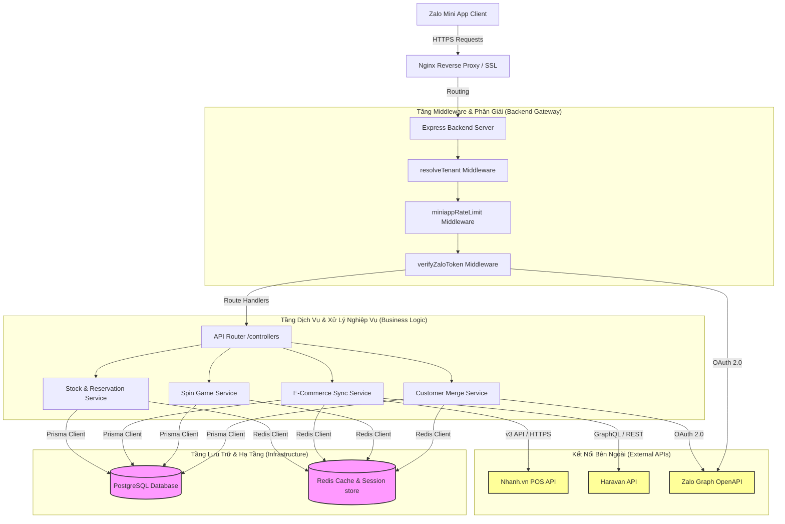
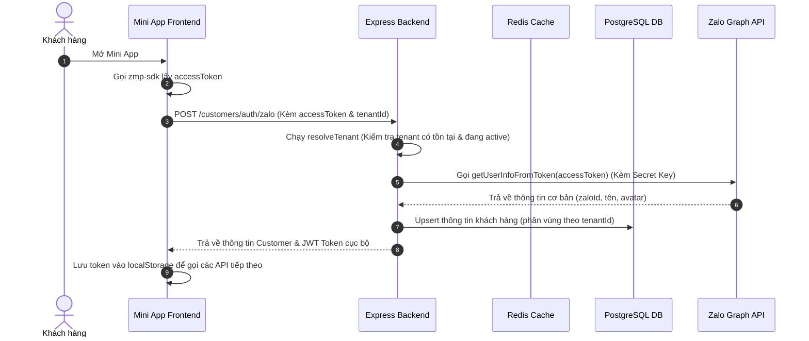
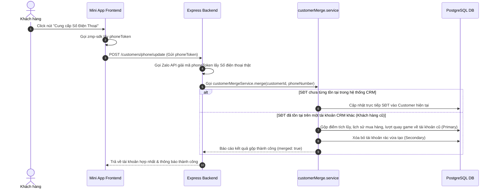

# 📘 TÀI LIỆU KIẾN TRÚC KỸ THUẬT & LUỒNG DỮ LIỆU ZALO MINI APP
> **Trạng thái thẩm định:** Bản nháp kỹ thuật (Technical Blueprint)  
> **Cấp độ kiến trúc:** Enterprise Multi-Tenant Production Ready  
> **Dự án:** Zalo Mini App (Tích hợp CRM, E-Commerce Nhanh.vn/Haravan & Gamification)

Tài liệu này cung cấp cái nhìn chi tiết nhất về toàn bộ cấu trúc mã nguồn, kiến trúc hệ thống, luồng dữ liệu nghiệp vụ (Runtime Flows), các điểm mạnh kiến trúc đã đạt chuẩn **Production** và danh sách tối ưu hóa bảo mật/hiệu năng trước khi chính thức Go-Live.

---

## 🗺️ 1. Sơ đồ Kiến trúc Hệ thống (System Architecture)

Dưới đây là mô hình phân tầng hoạt động của hệ thống từ Zalo Mini App client đến hạ tầng Backend đa doanh nghiệp (Multi-tenant):



---

## 📂 2. Toàn bộ Cấu trúc Thư mục (Project Directory Tree)

Dự án được tổ chức theo mô hình **Monorepo thu nhỏ** gồm 2 phần độc lập: `frontend` (React + Vite + ZMP SDK) và `backend` (Express + TypeScript + Prisma + Redis).

### 🖥️ A. Cấu trúc Frontend (`/frontend`)
```yaml
frontend/
├── package.json               # Cấu hình dependencies (React 18, Tailwind v4, ZMP SDK)
├── vite.config.ts             # Cấu hình Vite & Tailwind v4 compiler
├── tailwind.config.js         # Cấu hình token styles (phối hợp Tailwind v4)
├── app-config.json            # File cấu hình bắt buộc của Zalo Mini App (quy định routing, titlebar, app ID)
├── zmp-cli.json               # File cấu hình deploy/đóng gói của Zalo CLI
├── www/                       # Thư mục build đầu ra (chứa index.html, index.js, index.css)
└── src/
    ├── main.tsx               # Điểm khởi đầu của ứng dụng React
    ├── App.tsx                # Bộ định tuyến cấp cao (ZMP Router) & Cấu hình Providers
    ├── lib/
    │   └── api.ts             # API Client wrapper (tự động đính kèm Token và Bypass-Tunnel header)
    ├── context/
    │   └── AuthContext.tsx    # Quản lý trạng thái Đăng nhập Zalo, AccessToken, và Cơ chế mock dự phòng
    ├── hooks/                 # Custom React Hooks (useCart, useDebounce...)
    ├── components/            # UI Components dùng chung (Header, Navigation, SpinWheel, PopupModal)
    ├── css/
    │   └── app.css            # Styles tùy biến & Cấu trúc nền tảng Tailwind
    └── pages/                 # Danh sách màn hình chức năng:
        ├── Home.tsx           # Trang chủ hài hòa (Banners, Danh mục, Sản phẩm E-com, Vòng quay banner)
        ├── Profile.tsx        # Trang thông tin cá nhân & Lịch sử nhận quà
        ├── SpinGamePage.tsx   # Trang Vòng quay may mắn (tích hợp quay thưởng thời gian thực)
        ├── CartPage.tsx       # Giỏ hàng & Xử lý đặt đơn POS / E-com
        └── OrderHistory.tsx   # Lịch sử đơn hàng POS & trạng thái giao hàng
```

### ⚙️ B. Cấu trúc Backend (`/backend`)
```yaml
backend/
├── package.json               # Cấu hình runtime (NodeJS ES Modules, Prisma, tsx)
├── tsconfig.json              # Trình biên dịch TypeScript cấu hình strict mode
├── .env                       # Lưu trữ biến môi trường (Database URL, Redis connection, Zalo App Secret)
├── prisma/
│   └── schema.prisma          # Định nghĩa cấu trúc DB (PostgreSQL) & Tenant relations
└── src/
    ├── index.ts               # Điểm khởi chạy Server (Express, CORS setup, Graceful Shutdown)
    ├── types.ts               # Định nghĩa kiểu dữ liệu mở rộng cho Express Request (MiniappRequest)
    ├── lib/                   # Thư viện và công cụ dùng chung:
    │   ├── prisma.ts          # Singleton Prisma Client (Tách biệt Client thường và Client Raw không Tenant)
    │   ├── redis.ts           # Singleton Redis Connection
    │   ├── zaloApi.ts         # Wrapper gọi Zalo Graph API (Lấy SĐT, profile, refresh token OA)
    │   ├── stockManager.ts    # Logic khóa giữ tồn kho (Stock Reservation)
    │   ├── phone.helper.ts    # Chuẩn hóa định dạng số điện thoại Việt Nam (+84, 09x)
    │   └── response.helper.ts # Chuẩn hóa cấu trúc JSON trả về (successResponse, errorResponse)
    ├── middlewares/           # Tầng lọc Request (Interceptors):
    │   ├── resolveTenant.ts   # Tự động phân giải Tenant ID từ UUID, lấy từ cache hoặc DB
    │   ├── verifyZaloToken.ts # Giải mã & xác minh tính hợp lệ AccessToken của khách hàng gửi từ Mini App
    │   ├── verifyCustomerOwnership.ts # Bảo vệ dữ liệu, kiểm tra tính sở hữu dữ liệu của khách hàng
    │   └── miniappRateLimit.ts # Giới hạn tần suất gọi API (Rate Limiting) bằng Redis
    ├── routes/                # Định tuyến API:
    │   ├── index.ts           # Router trung tâm gộp toàn bộ phân hệ API
    │   ├── auth.routes.ts     # Các API đăng nhập, cập nhật SĐT, gộp tài khoản
    │   ├── ecommerce.routes.ts# API danh sách sản phẩm, tạo đơn hàng Nhanh/Haravan
    │   └── game.routes.ts     # API Vòng quay may mắn, điểm tín dụng, lịch sử trúng thưởng
    ├── services/              # Tầng xử lý logic nghiệp vụ độc lập:
    │   ├── customerMerge.service.ts # Giải thuật thông minh tự động gộp tài khoản CRM khi trùng SĐT
    │   ├── spinGame.service.ts      # Logic tính toán xác suất phần thưởng, kiểm tra lượt quay
    │   └── ecomService.ts           # Tích hợp kết nối trực tiếp với API sàn thương mại điện tử
    └── validators/            # Tầng xác thực dữ liệu đầu vào (Zod Schemas)
```

---

## ⚡ 3. Luồng Dữ Liệu Nghiệp Vụ Đặc Thù (Core Business Flows)

### 🔄 A. Luồng Đăng nhập & Xác thực Đa Doanh Nghiệp (Multi-Tenant Auth)
Khi người dùng mở Mini App, quá trình đăng nhập và xác thực diễn ra hoàn toàn khép kín bảo mật:



### 🤝 B. Luồng Lấy Số Điện Thoại & Gộp Tài Khoản CRM Thông Minh (Smart Merging)
Tránh việc khách hàng có nhiều bản ghi rác trong hệ thống khi đăng ký bằng các phương thức khác nhau:



---

## 💎 4. Các Điểm Mạnh Kiến Trúc Đạt Chuẩn Production (Production Strengths)

Kiến trúc hiện tại của dự án có rất nhiều thành phần được thiết kế vô cùng xuất sắc và đạt tiêu chuẩn vận hành thực tế:

1. **Cô lập Đa Doanh nghiệp (Multi-Tenant Isolation)**:
   * Toàn bộ API nghiệp vụ đều nằm dưới route phân vùng `/api/t/:accountId`. 
   * Middleware `resolveTenant` giải quyết việc phân giải Tenant tự động, kết hợp **Redis caching lớp 1** giúp giảm tải 90% lượng query lặp lại vào PostgreSQL.
2. **Hệ thống Gộp Tài Khoản Thông Minh (Smart CRM Merging)**:
   * Giải quyết được bài toán khó nhất của CRM: Khách hàng mua hàng từ POS (có SĐT trước) nay vào Zalo Mini App (chỉ có Zalo ID). Hệ thống tự gộp lịch sử đơn hàng, điểm số và dữ liệu quay thưởng về một tài khoản duy nhất khi họ nhấn xác nhận SĐT.
3. **An toàn chống tấn công (DDoS & Brute Force Protection)**:
   * Middleware `miniappRateLimit` sử dụng `rate-limiter-flexible` kết hợp Redis giúp ngăn chặn các request spam, khóa các hành vi cố tình cào dữ liệu hoặc spam quay thưởng trái phép.
4. **Idempotency & Khóa Kho Tạm (Stock Reservation)**:
   * Hệ thống tạo đơn hàng POS tích hợp cơ chế `idempotency-key` chống việc người dùng nhấn đúp tạo 2 đơn hàng trùng lặp.
   * `stockReservationService` khóa giữ tồn kho tạm thời khi người dùng thanh toán và tự động hoàn trả (rollback) nếu giao dịch thất bại, tránh tình trạng bán vượt tồn kho (overselling).
5. **Chống Cache Stampede (Single-Flight Caching)**:
   * Logic lấy game đang hoạt động (`/spin-games/active`) sử dụng cơ chế kiểm soát tiến trình để tránh tình trạng hàng nghìn request cùng lúc chọc thẳng vào database khi cache hết hạn.
6. **Tắt kết nối an toàn (Graceful Shutdown)**:
   * Đầy đủ bộ bắt tín hiệu kết thúc ứng dụng `SIGTERM`/`SIGINT` giúp giải phóng kết nối Prisma và Redis an toàn, không gây nghẽn tiến trình khi deploy phiên bản mới.

---

## ⚠️ 5. Các Lỗ Hổng Cần Khắc Phục Trước Khi Go-Live (Hardening Checklist)

> [!WARNING]
> Dưới đây là các điểm cần cấu hình lại lập tức trước khi phân phối ứng dụng cho người dùng thực tế. Việc bỏ qua các cảnh báo này có thể dẫn tới rò rỉ dữ liệu hoặc lỗi vận hành.

### 🔴 MỨC ĐỘ NGUY HIỂM: CAO (CRITICAL)

#### 1. CORS Mở Rộng Quá Mức (`origin: '*'`)
* **Vấn đề:** Hiện tại ở `backend/src/index.ts` đang cho phép bất kỳ domain nào cũng có thể gọi API. Kẻ xấu có thể nhúng API của bạn vào website của họ để spam dịch vụ.
* **Cách khắc phục:** Siết chặt chỉ cho phép domain của Zalo Mini App (Webview) hoặc whitelist cụ thể:
  ```typescript
  app.use(cors({
    origin: ['https://h5.zdn.vn', /\.zalo\.me$/], // Chỉ cho phép domain của hệ sinh thái Zalo
    methods: ['GET', 'POST', 'PUT', 'DELETE', 'OPTIONS'],
    allowedHeaders: ['Content-Type', 'Authorization', 'x-correlation-id', 'bypass-tunnel-reminder', 'Bypass-Tunnel-Reminder']
  }));
  ```

#### 2. Rủi Ro Mock Token Ở Môi Trường Production
* **Vấn đề:** File `AuthContext.tsx` ở frontend và `verifyZaloToken.ts` ở backend có luồng tự động trả về mock token `'mock-access-token-aizen-test'` nếu việc lấy token từ Zalo SDK bị lỗi. Nếu deploy lên Production, kẻ xấu có thể làm giả request để có tài khoản test mà không cần quét Zalo.
* **Cách khắc phục:** Sử dụng biến môi trường `process.env.NODE_ENV` hoặc `import.meta.env.MODE` để tắt hoàn toàn luồng mock này khi deploy production (chỉ cho phép mock ở localhost/development).
  ```typescript
  if (process.env.NODE_ENV === 'production' && isMockToken) {
      throw new Error('Chế độ giả lập không được phép trên hệ thống Live');
  }
  ```

#### 3. URL Fallback Trỏ Về Localhost
* **Vấn đề:** Biến `SALE_FUNNEL_BACKEND_URL` ở backend đang để dự phòng là `http://localhost:10007`. Khi chạy Live trên máy chủ VPS/Docker, nếu bạn quên cấu hình biến môi trường, hệ thống sẽ cố gắng kết nối tới `localhost` của VPS và báo lỗi 500.
* **Cách khắc phục:** Yêu cầu bắt buộc phải truyền biến này trong file cấu hình `.env` của Production, nếu thiếu thì chương trình phải báo lỗi ngay từ lúc khởi chạy chứ không dùng fallback localhost.

---

### 🟡 MỨC ĐỘ NGUY HIỂM: TRUNG BÌNH (MEDIUM)

#### 1. Chuyển Đổi Structured Logger
* **Vấn đề:** Hệ thống đang sử dụng rất nhiều lệnh `console.log` và `console.error`. Khi chạy trên môi trường production lớn, điều này sẽ làm chậm IO của Node.js và khó khăn trong việc gom logs về các hệ thống như ElasticSearch/Loki.
* **Cách khắc phục:** Tận dụng file [logger.ts](file:///d:/TrangWebCongTy/zalo-mini-app/backend/src/lib/logger.ts) đã được cấu hình sẵn bằng thư viện Logger chuẩn thay vì gọi `console.log` trực tiếp.

#### 2. Kích Thước File Bundle Frontend Lớn (> 500KB)
* **Vấn đề:** Khi build frontend, Vite đưa ra cảnh báo file `index.js` vượt quá 500KB. Điều này sẽ làm tăng thời gian tải trang đầu tiên của khách hàng khi mở Zalo Mini App qua mạng 3G/4G yếu.
* **Cách khắc phục:** Sử dụng tính năng Code-Splitting của Vite thông qua `dynamic import()` các trang con hoặc cấu hình `build.rollupOptions.output.manualChunks` để chia nhỏ các thư viện dùng chung (như Lucide React, ZMP SDK).

---

## 🛠️ 6. Check-List Chuẩn Bị Vận Hành (Production Deployment Checklist)

Trước khi gửi bản build cho đội ngũ QA hoặc bàn giao cho quản trị viên hệ thống, hãy đảm bảo đã hoàn thành các bước sau:

- [ ] **Bước 1:** Đóng gói ứng dụng frontend với cấu hình API_HOST thật (Không dùng link localtunnel tạm thời).
- [ ] **Bước 2:** Whitelist tên miền API của bạn trong trang **Zalo Mini App Console** -> Cài đặt nâng cao -> Danh sách tên miền được phép gọi API (nếu không làm bước này, điện thoại thật sẽ không thể kết nối tới server).
- [ ] **Bước 3:** Điền đầy đủ thông tin `ZALO_APP_ID` và `ZALO_APP_SECRET` vào file `.env` ở backend máy chủ Live để tính năng lấy SĐT thật của Zalo hoạt động.
- [ ] **Bước 4:** Bật cấu hình mã hóa token của Nhanh/Haravan trong cơ sở dữ liệu (`TOKEN_ENCRYPTION_KEY_HEX`) để bảo mật tuyệt đối dữ liệu kết nối doanh nghiệp.
- [ ] **Bước 5:** Bật cơ chế tự động Backup cơ sở dữ liệu PostgreSQL hàng ngày.

---

*Tài liệu này được biên soạn tự động dựa trên hiện trạng cấu trúc dự án thực tế và các quy tắc tối ưu hóa hệ thống chuẩn Quốc Tế.*
