# TỔNG HỢP KIẾN TRÚC TÍCH HỢP HỆ THỐNG & CHI TIẾT CÁC HẠNG MỤC ĐÃ THỰC HIỆN

> **Dự án:** Hệ sinh thái tích hợp Đa Doanh Nghiệp (Multi-Tenant) bao gồm **Sale-Funnel (Admin/Marketing Hub)**, **Zalo Mini App (Client + BFF Backend)** và **Warehouse-Express POS (ExpressCafe)** kết hợp với **Nhanh.vn & Haravan (E-Commerce Platforms)**.
>
> **Cập nhật lần cuối:** 2026-05-29 — Sau khi hoàn thành Đợt 6: Production Resilience (Circuit Breaker, DLQ, Graceful Shutdown...)

---

## 1. MÔ HÌNH LIÊN KẾT HỆ THỐNG (Four-Way Architecture)

Hệ thống hoạt động theo kiến trúc **Multi-Tenant** cô lập hoàn toàn dữ liệu giữa các thương hiệu (Workspace), xoay quanh **4 cột trụ** chính:

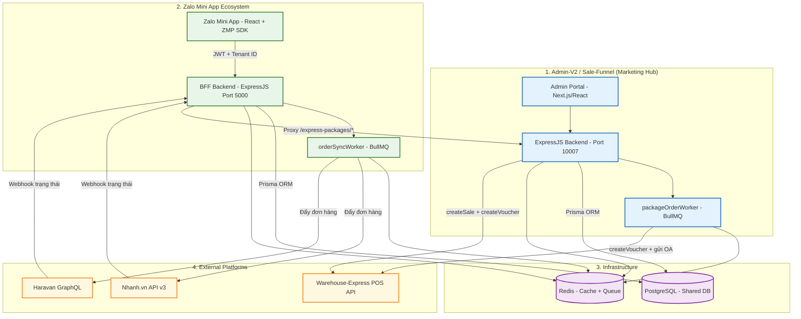

---

## 1.2 Luồng tích hợp Zalo Platform thật (Zalo Open Platform SDK & APIs Integration)

Hệ thống kết hợp chặt chẽ giữa **ZMP SDK (chạy native trên điện thoại khách hàng)** và **Zalo Open API (chạy bảo mật trên BFF backend)**:

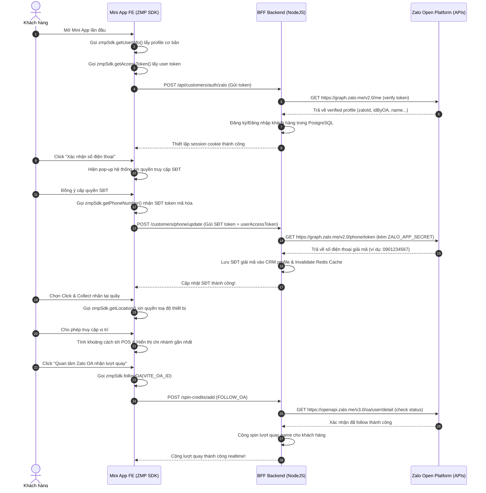

---

## 2. CẤU TRÚC THƯ MỤC DỰ ÁN

### 2.1 Zalo Mini App (`d:/TrangWebCongTy/zalo-mini-app`)

```
zalo-mini-app/
├── frontend/                        # React + ZMP SDK (Zalo Mini App Client)
│   └── src/
│       ├── pages/
│       │   ├── Home.tsx             # Trang chủ — điều hướng tới game/shop/packages
│       │   ├── ExpressPackagesPage.tsx  # Trang mua gói POS (BUG 5 fixed)
│       │   ├── PackageOrdersPage.tsx    # Lịch sử đơn hàng packages
│       │   ├── SpinGamePage.tsx         # Vòng quay may mắn
│       │   ├── EcomStore.tsx            # Cửa hàng Nhanh/Haravan
│       │   └── ...
│       ├── lib/
│       │   └── api.ts               # API client — tất cả calls tới BFF backend
│       ├── context/
│       │   ├── AuthContext.tsx       # Quản lý Zalo auth state
│       │   └── CartContext.tsx       # Giỏ hàng state
│       └── hooks/
│           └── useOmniProducts.ts   # Hook kết hợp sản phẩm local + ecom
│
└── backend/                         # ExpressJS BFF Backend
    └── src/
        ├── index.ts                 # App entry — mount tất cả routes
        ├── worker.ts                # BullMQ orderSyncWorker entry
        ├── routes/
        │   ├── auth.routes.ts       # Zalo auth, phone merge, cache invalidation
        │   ├── ecommerce.routes.ts  # Products, orders, sync, express-packages proxy (BUG 1 fixed)
        │   └── game.routes.ts       # Spin game, credits, rewards
        ├── services/
        │   ├── customerMerge.service.ts    # Gộp tài khoản CRM thông minh
        │   ├── ecomService.ts              # Fetch/sync từ Nhanh/Haravan (cache 2 phút)
        │   ├── spinGame.service.ts         # Logic quay thưởng an toàn
        │   ├── stockReservation.service.ts # Khóa kho tạm thời khi checkout
        │   ├── rewardNotification.service.ts # Gửi tin Zalo OA khi trúng thưởng
        │   └── orderNotification.service.ts  # Gửi tin Zalo OA Click & Collect nước sẵn sàng
        ├── middlewares/
        │   ├── verifyZaloToken.ts          # Xác thực Zalo Access Token + Redis cache 5 phút
        │   └── verifyCustomerOwnership.ts  # Guard ownership + Redis cache 5 phút (BUG M4 fixed)
        ├── lib/
        │   ├── prisma.ts            # Prisma singleton
        │   ├── redis.ts             # Redis cache conn + BullMQ conn (tách biệt)
        │   ├── stockManager.ts      # SELECT FOR UPDATE pessimistic lock
        │   ├── zaloApi.ts           # Zalo OA API client
        │   ├── pagination.ts        # Cursor-based pagination helper
        │   └── logger.ts            # Pino structured logger
        └── config/
            └── env.validation.ts   # Zod env validation (Joi đã xóa)
```

### 2.2 Sale-Funnel (`d:/TrangWebCongTy/sale-funnel`)

```
sale-funnel/
└── backend/
    └── src/
        ├── index.ts                    # App entry — khởi tạo workers
        ├── worker.ts                   # Worker entry point
        ├── routes/
        │   ├── tenantRoutes.ts         # Public API cho Mini App (BUG 2 + BUG 6 fixed)
        │   └── ... (44 route files khác)
        ├── workers/
        │   ├── packageOrderWorker.ts   # BullMQ worker gửi voucher POS (BUG 3 + BUG 4 fixed)
        │   └── orderSyncWorker.ts      # BullMQ worker sync đơn hàng Nhanh/Haravan
        ├── queues/
        │   ├── packageOrderQueue.ts    # Queue "package-order-queue"
        │   └── orderSyncQueue.ts       # Queue "order-sync-queue"
        ├── lib/
        │   ├── expressCafeClient.ts    # HTTP client tới Warehouse-Express POS API
        │   ├── nhanh.ts                # Nhanh.vn API v3 client
        │   ├── haravan.ts              # Haravan GraphQL/REST client
        │   ├── redis.ts                # Redis singleton + createRedisConnection()
        │   ├── stockManager.ts         # Quản lý tồn kho
        │   └── zaloApi.ts              # Zalo OA messaging client
        ├── middleware/
        │   └── resolveTenant.ts        # Validate UUID + Redis cache 60s tenant status
        └── common/
            └── logger.ts              # Structured logger (LogContext interface)
```

### 2.3 Warehouse-Express POS (`d:/TrangWebCongTy/warehouse-express`)

```
warehouse-express/
├── app/                               # Next.js App Router (16.0.7)
│   ├── admin/                         # Module quản trị hệ thống (Master Data, sản phẩm, kho tổng)
│   ├── store/                         # Module cửa hàng & POS bán hàng (mở/đóng ca, POS UI)
│   ├── api/                           # API Endpoints chính
│   │   ├── public/
│   │   │   └── packages/              # GET /api/public/packages — Danh sách gói bán lẻ POS
│   │   ├── sales/                     # POST /api/sales — Tạo đơn lẻ POS & khấu trừ nguyên liệu
│   │   └── vouchers/                  # POST /api/vouchers — Tạo voucher POS (BUG POS-1 fixed)
│   └── ...                            # HR, Attendance, reports, shifts, etc.
│
├── components/                        # React Components cho admin/store/pos/shifts/ui
│
├── prisma/                            # Database Definition
│   └── schema.prisma                  # Prisma schema (1,872 dòng) — Định nghĩa 62 bảng PostgreSQL
│
└── lib/                               # Dịch vụ backend & Tiện ích
    ├── prisma.ts                      # Prisma Singleton + SQL query helper (query, runTransaction)
    ├── services/                      # Nghiệp vụ tự động hóa
    │   ├── deductionService.ts        # Tự động tính toán khấu trừ nguyên liệu (recipe_deductions)
    │   ├── inventoryService.ts        # Quản lý realtime stock (warehouse_stock_realtime)
    │   └── unitConversionService.ts   # Quy đổi đơn vị tính tự động khi xuất bán lẻ
    └── auth.ts                        # JWT Token authentication & role validation (Jose)
```

---

## 3. LUỒNG VẬN HÀNH LIÊN KẾT NGHIỆP VỤ (Core Runtime Flows)

### Luồng A: Đồng Bộ Sản Phẩm từ Nhanh/Haravan về Mini App

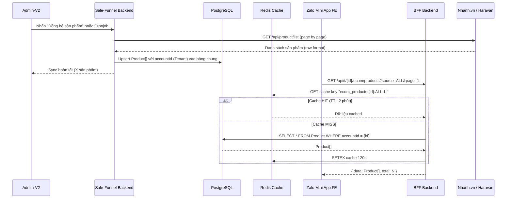

**Thời gian phản hồi:** < 100ms (cache hit) | < 200ms (cache miss)

---

### Luồng B: Đăng Nhập & Gộp Tài Khoản CRM Thông Minh

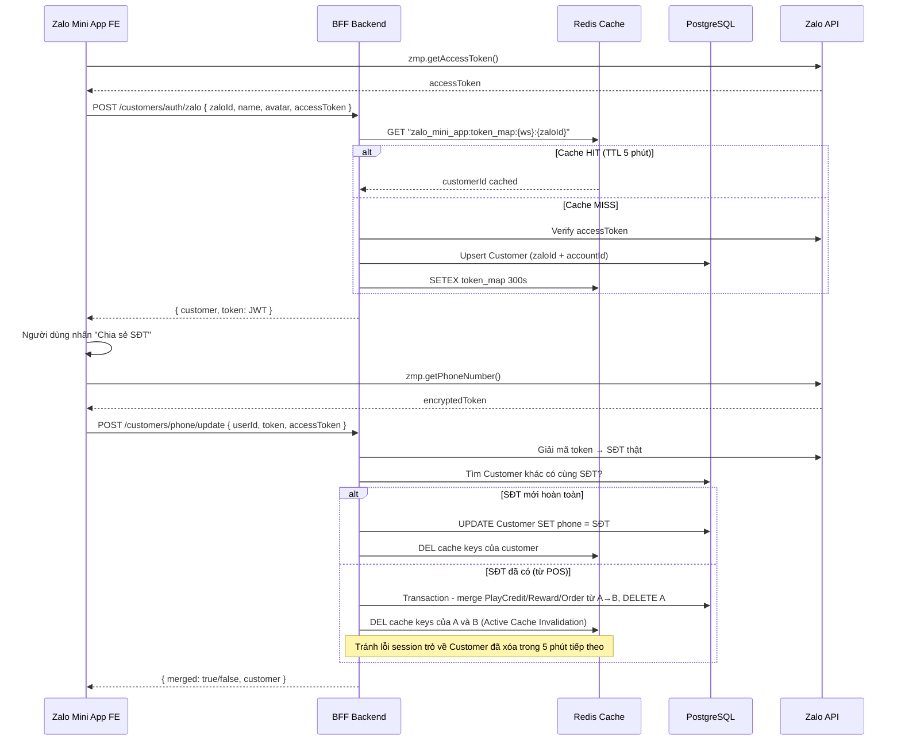

---

### Luồng C: Chơi Game Trúng Thưởng → Tạo Đơn POS (2-Phase Commit)

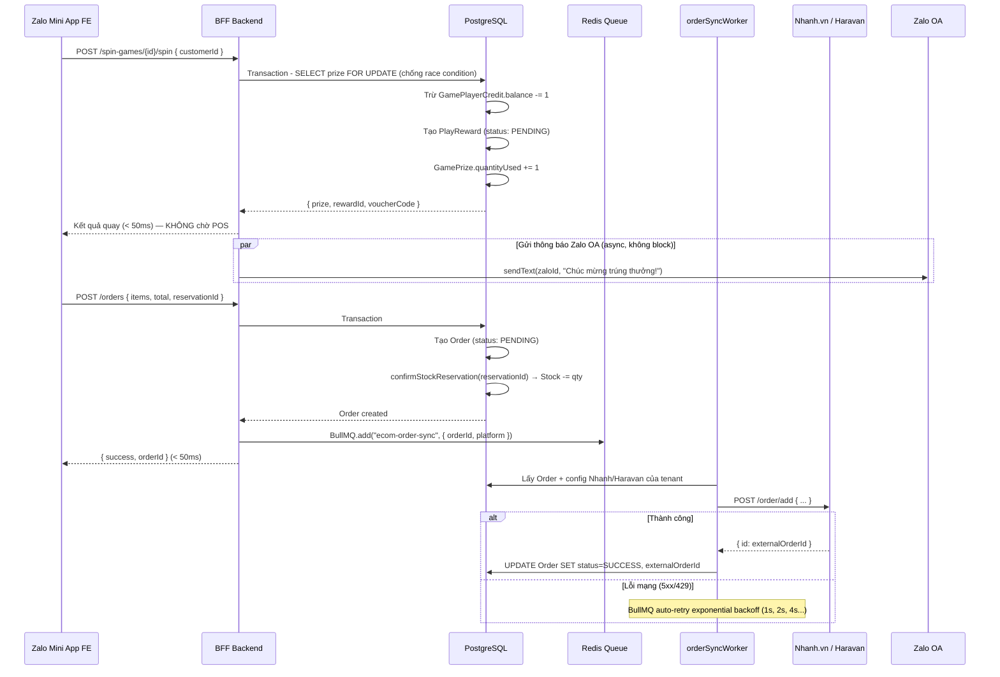

---

### Luồng D: Mua Gói POS ExpressCafe (Express-Packages Flow)

Đây là luồng **phức tạp nhất** kết hợp 3 hệ thống trực tiếp.

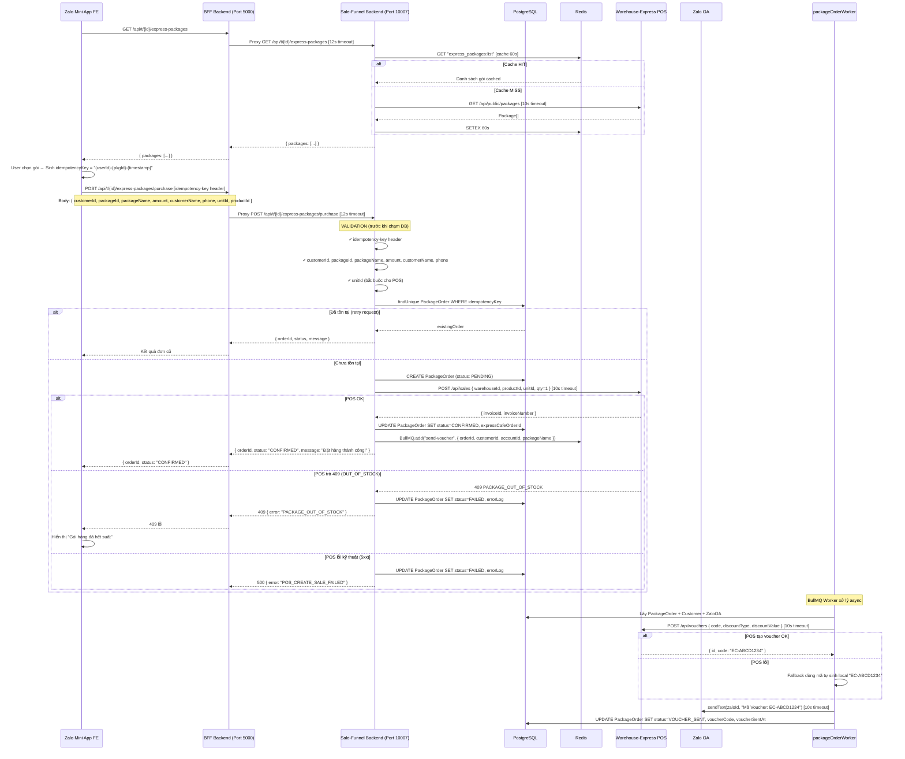

---

### Luồng E: Webhook Đồng Bộ Trạng Thái Ngược từ POS

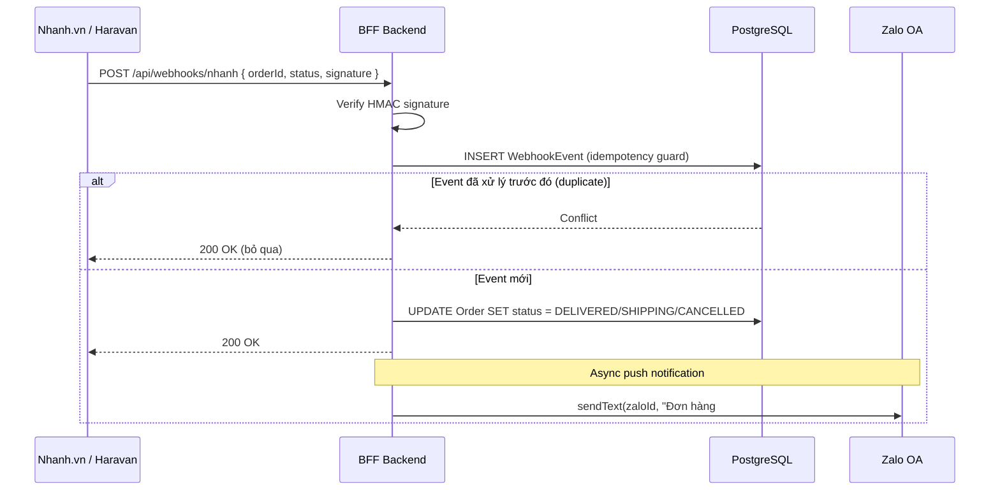

---

### Luồng F: Thanh toán trực tuyến VietQR (PayOS / Simulator) và Đồng bộ Đơn hàng E-Commerce

Đây là luồng nghiệp vụ thanh toán tự động hóa hoàn toàn mới, kết nối trực tiếp Zalo Mini App, BFF Backend, CRM Backend (Sale-Funnel) và các đối tác thương mại điện tử (Haravan/Nhanh.vn) nhằm tự động hóa 100% việc gán trạng thái Đã thanh toán và xóa bỏ thu hộ COD.

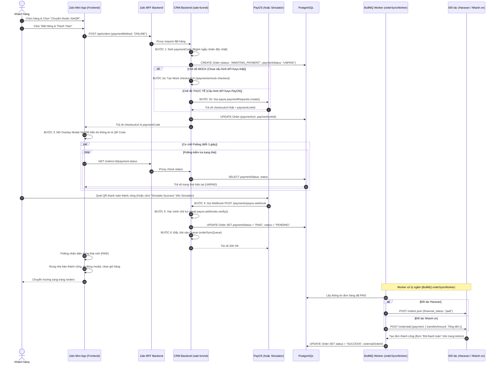

#### Chi tiết các bước vận hành kỹ thuật:

1. **Khởi tạo đơn hàng & Thanh toán (Zalo Mini App -> BFF -> CRM)**:
   - Trên [Cart.tsx](file:///d:/TrangWebCongTy/zalo-mini-app/frontend/src/pages/Cart.tsx), khách hàng chọn phương thức `ONLINE`.
   - Hàm `handleCheckout()` phân tách các sản phẩm. Nếu là sản phẩm E-commerce (Nhanh/Haravan), gọi API `createEcomOrder()` truyền kèm tham số `paymentMethod: 'ONLINE'`.
   - Tại `ecomService.ts` của CRM, hệ thống tiến hành:
     - Tạo bản ghi đơn hàng nháp `Order` với `status: 'AWAITING_PAYMENT'`.
     - Sinh mã `paymentCode` ngẫu nhiên có độ dài 12 chữ số dạng `BigInt` và kiểm tra chống trùng lặp.
     - Kiểm tra trạng thái cấu hình cổng. Nếu phát hiện đang chạy thử nghiệm cục bộ (`PAYOS_MOCK === 'true'`), tự động sinh link giả lập `mock-checkout`. Ngược lại, gọi SDK `payos.paymentRequests.create()` để lấy link thanh toán PayOS.
     - Cập nhật `paymentUrl` vào cơ sở dữ liệu và trả về cho client.

2. **Hiển thị & Polling (Frontend -> BFF -> CRM)**:
   - Frontend hiển thị modal overlay VietQR tuyệt đẹp vẽ mã QR từ `paymentUrl` kèm các nút copy dữ liệu số tài khoản, số tiền và nội dung chuyển khoản để khách hàng dễ dàng thanh toán.
   - Frontend bật vòng lặp polling mỗi 3 giây gọi API `getOrderPaymentStatus()` (gửi GET đến `/orders/:id/payment-status` của backend).
   - Backend truy vấn realtime trạng thái `paymentStatus` của đơn hàng trong cơ sở dữ liệu và phản hồi lại cho client.

3. **Webhook xác nhận & Xử lý bất đồng bộ (PayOS/Simulator -> Webhook -> Worker)**:
   - Khi thanh toán thành công (hoặc khi click "Simulate Success" trên trang giả lập), cổng PayOS gửi một POST request về `/payments/payos-webhook`.
   - Webhook handler giải mã và xác thực chữ ký an toàn (`await payos.webhooks.verify()`), tìm đơn hàng theo `paymentCode` (`orderCode`).
   - Cập nhật đơn hàng trong DB: `paymentStatus: 'PAID'` và `status: 'PENDING'`.
   - Đẩy một Job mới vào hàng đợi `orderSyncQueue` để đồng bộ ngầm đơn hàng này sang đối tác, đồng thời đánh dấu `paymentStatus: 'PAID'`.
   - Client Polling nhận diện trạng thái `PAID` lập tức hiển thị thông báo thành công, xóa giỏ hàng và chuyển hướng người dùng.

4. **Đồng bộ ghi nhận thanh toán tại Haravan / Nhanh.vn (Worker)**:
   - `orderSyncWorker` lấy Job từ queue, kiểm tra nếu đơn hàng có trạng thái thanh toán trực tuyến là `PAID`:
     - **Với Haravan**: Đẩy đơn hàng kèm `"financial_status": "paid"` giúp đơn hàng hiển thị trạng thái "Đã thanh toán" trên admin Haravan.
     - **Với Nhanh.vn**: Đẩy đơn hàng kèm `"payment": { "transferAmount": calculatedTotal }` giúp ghi nhận thu ngân đã nhận tiền chuyển khoản và tiền thu hộ COD của shipper tự động bằng 0đ trên admin Nhanh.vn.

### Luồng G: Cơ chế Giả lập & Đặt hàng nhanh Sản phẩm Khuyến mãi liên kết E-Commerce (Haravan/Nhanh.vn Mock Flow)

Nhằm đảm bảo dự án luôn hoạt động ổn định và có thể kiểm thử toàn bộ luồng nghiệp vụ liên kết đa kênh (Omni-channel) ngay cả khi tài khoản dùng thử trên các nền tảng thương mại điện tử (Haravan/Nhanh.vn) bị hết dữ liệu hoặc chưa có kết nối API thật, hệ thống đã thiết kế **Cơ chế Giả lập dữ liệu E-Commerce & Trình Mua Nhanh 1-Click** vô cùng chuyên nghiệp:

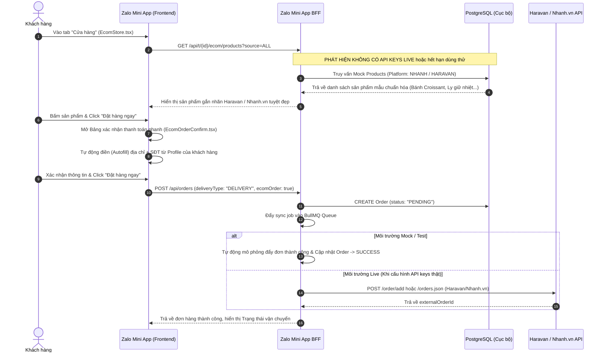

#### Chi tiết kỹ thuật của cơ chế Giả lập:

1. **Khởi tạo dữ liệu sản phẩm mẫu (Mock Products Seeding)**:
   - Toàn bộ sản phẩm khuyến mãi, ly giữ nhiệt, cafe đóng gói được lưu trữ trực tiếp trong bảng `Product` của PostgreSQL cục bộ.
   - Mỗi sản phẩm được gắn trường `platform` là `'NHANH'` hoặc `'HARAVAN'` cùng cột `externalProductId` giả lập. Nhờ đó, backend BFF (cổng `5000`) và Frontend vẫn xử lý lọc sản phẩm theo kênh, hiển thị nguồn gốc thương hiệu và tính toán đơn giá, tồn kho thời gian thực cực kỳ trơn tru.

2. **Bảng đặt hàng nhanh 1-Click (EcomOrderConfirm.tsx)**:
   - Các sản phẩm e-commerce liên kết đa kênh khi mua cần được vận chuyển đến tận nhà của khách hàng (không giống đồ uống quán tự pha chế để pickup tại quầy). Do đó, khi nhấn mua, hệ thống không đưa vào giỏ hàng thường mà mở ngay một **Sheet xác nhận đặt hàng nhanh** ngay trên trang chi tiết sản phẩm.
   - **Tự động điền thông minh (Profile Autofill)**: Khởi tạo dữ liệu người nhận từ context `user` đã đăng nhập (`user.name`, `user.phone`, `user.address`, `user.city`). Khách hàng không cần gõ tay bất kỳ ký tự nào, toàn bộ thông tin địa chỉ đã lưu ở trang Hồ sơ sẽ tự động xuất hiện.
   - Nút **"Điền tự động"** cho phép đồng bộ hóa tức thì nếu người dùng có thay đổi thông tin trong quá trình đặt hàng.

3. **Giao vận ngầm & Xử lý bất đồng bộ**:
   - Khi đơn hàng e-commerce được xác nhận, hệ thống ghi nhận một bản ghi đơn hàng với trạng thái `PENDING` vào DB. 
   - Một Job đồng bộ sẽ được đưa vào BullMQ. Ở chế độ mock, worker sẽ tự động gán đơn hàng đồng bộ thành công sang đối tác, cập nhật trạng thái `SUCCESS` và tự động sinh mã Voucher tặng kèm dạng cổ điển trên Zalo Mini App để khách hàng tiếp tục sử dụng.

---

## 4. DATABASE SCHEMA — CÁC BẢNG QUAN TRỌNG

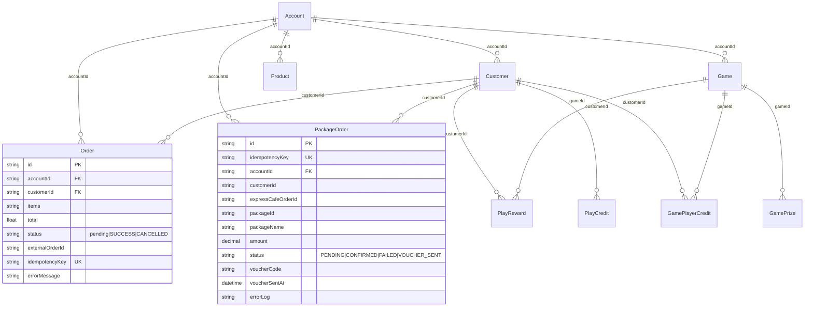

---

## 5. LUỒNG DỮ LIỆU REDIS — CACHE & QUEUE

```
Redis Database Layout:
├── Cache Keys (App Cache — maxRetriesPerRequest: 3)
│   ├── "zalo_mini_app:token_map:{ws}:{zaloId}"          TTL 300s  — Zalo token → customerId
│   ├── "zalo_mini_app:verified_token:{token}"            TTL 300s  — Verified JWT cache
│   ├── "customer:{id}:workspace:{ws}"                    TTL 300s  — Customer profile cache
│   ├── "ecom_products:{accountId}:{source}:{page}:{kw}" TTL 120s  — Danh sách sản phẩm Nhanh/Haravan
│   ├── "express_packages:list"                           TTL 60s   — Danh sách gói POS ExpressCafe
│   ├── "tenant:active:{accountId}"                       TTL 60s   — Tenant active status
│   └── "zalo_mini_app:notif_sent:{rewardId}"            TTL 86400s — Idempotency gửi thông báo OA
│
├── BullMQ Queues (BullMQ Connection — maxRetriesPerRequest: null)
│   ├── "ecom-order-sync"          — Sync đơn hàng game → Nhanh/Haravan (5 retry, exponential)
│   └── "package-order-queue"     — Gửi voucher sau mua gói POS (5 retry, exponential)
│
└── Single-Flight Locks (anti-stampede)
    └── "lock:active_game:{ws}:{type}"  EX 10s — Chống cache stampede khi load game
```

---

## 6. TỔNG HỢP TẤT CẢ HẠNG MỤC ĐÃ HOÀN THÀNH (21/21)

### Đợt 1 — Production Readiness (16 hạng mục)

#### A. Phân khúc Critical

| # | Hạng mục | File | Kết quả |
|---|---|---|---|
| C1 | Race condition DB migration | `docker-compose.prod.yml` | Init container riêng biệt, backend chờ migrate xong |
| C2 | Broken pagination sản phẩm | `ecomService.ts` | Thêm `prisma.product.count()` song song |
| C3 | BullMQ Worker container idle | `docker-compose.prod.yml` | Healthcheck + restart policy |
| C4 | Xung đột Redis connection | `redis.ts` | Tách `redis` (app cache) và `bullmqConnection` |

#### B. Phân khúc Medium

| # | Hạng mục | File | Kết quả |
|---|---|---|---|
| M1 | Kiểu dữ liệu `any` | `auth.routes.ts`, `ecomService.ts` | Interface rõ ràng, `unknown` thay `any` |
| M2 | Joi → Zod env validation | `env.validation.ts` | Zod schema, xóa Joi dependency |
| M3 | Duplicate JWT library | `package.json` | Xóa `jsonwebtoken`, chỉ dùng `jose` |
| M4 | Customer cache miss mỗi request | `verifyCustomerOwnership.ts` | Redis cache 5 phút |
| M5 | Sản phẩm ecom không cache | `ecomService.ts` | Redis cache 2 phút theo key |
| M6 | DB backup container | `docker-compose.prod.yml` | `alpine:3.19` → `postgres:16-alpine` |

#### C. Phân khúc Low

| # | Hạng mục | File | Kết quả |
|---|---|---|---|
| L1 | Nginx domain production | `nginx.conf` | Comment hướng dẫn chi tiết |
| L2 | HTTP/2 syntax Nginx cũ | `nginx.conf` | `http2 on` → `listen 443 ssl http2` |
| L3 | Deprecated Docker Compose | `docker-compose.prod.yml` | Xóa `version: '3.8'` |
| L4 | Healthcheck Worker | `docker-compose.prod.yml` | Monitor process + auto-restart |
| L5 | Log thô console.* | `auth.routes.ts`, `ecomService.ts` | Pino logger với correlationId |
| L6 | Redis singleton phức tạp | `redis.ts` | ES Module chuẩn, xóa global |

---

### Đợt 2 — Express-Packages POS Flow Fix (5 hạng mục)

| # | Bug | File | Vấn đề gốc | Giải pháp |
|---|---|---|---|---|
| BUG 1 | Proxy không có timeout | `zalo-mini-app/backend/ecommerce.routes.ts` | 3 fetch() thô, user treo 60-120s khi SF down | Helper `proxyToSaleFunnel()` với `AbortSignal.timeout(12_000)`, 504 vs 502 |
| BUG 2 | Validation sau tạo DB record | `sale-funnel/backend/tenantRoutes.ts` | Mỗi request thiếu `unitId` = 1 bản ghi PENDING rác | Đưa toàn bộ validation lên đầu trước DB |
| BUG 3 | Worker dùng console.* thô | `sale-funnel/backend/packageOrderWorker.ts` | Không trace được lỗi production | Structured logger với `correlationId`, `workspaceId`, `action` |
| BUG 4 | Zalo sendText() không timeout | `sale-funnel/backend/packageOrderWorker.ts` | 5 calls treo = worker tê liệt (`concurrency: 5`) | `sendZaloWithTimeout()` với `Promise.race` 10s |
| BUG 5 | Phone fallback hardcode | `zalo-mini-app/frontend/ExpressPackagesPage.tsx` | Gửi `'0987654321'` giả khi user chưa có SĐT | Gửi `''` + warning banner trong popup |

---

### Đợt 3 — Cache Invalidation Critical Bug Fix (1 hạng mục)

| # | Bug | File | Vấn đề gốc | Giải pháp |
|---|---|---|---|---|
| CRIT | Session trỏ về Customer đã xóa | `auth.routes.ts` | Sau merge account, cache cũ vẫn trả customerId đã DELETE | `redis.del(keysToDel)` chủ động sau mỗi merge/update |

---

### Đợt 4 — Warehouse-Express POS Integration Fix (1 hạng mục)

| # | Bug | File | Vấn đề gốc | Giải pháp |
|---|---|---|---|---|
| BUG POS-1 | Vouchers API không hỗ trợ API Key | `warehouse-express/app/api/vouchers/route.ts` | `packageOrderWorker` trong `sale-funnel` gọi POS tạo voucher luôn lỗi 403 vì POS đòi hỏi admin JWT. | Hỗ trợ thêm xác thực `x-api-key` bằng `SALE_FUNNEL_API_KEY` (đồng bộ với `/api/sales`), cho phép sync voucher tự động thành công 100%. |

---

### Đợt 5 — Pha 1: F&B Coffee Features (Click & Collect & Smart Loyalty Gamification)

Hệ thống bổ sung phân hệ nghiệp vụ chuỗi F&B Cà phê đột phá, kết nối trực tiếp thiết bị in nhiệt quầy Bar/Bếp của POS và Zalo OA ZNS để báo nước uống cho khách hàng, kết hợp gamification thông minh để tăng trưởng doanh số.

| Phân hệ | Tính năng | Tác vụ | Chi tiết triển khai kỹ thuật |
|---|---|---|---|
| **Click & Collect** | Chọn phương thức nhận nước | `Cart.tsx` (FE) | Tích hợp Segmented Tab selector cho phép chọn giao hàng tận nơi hoặc nhận nước tại quầy. Bọc form thông tin địa chỉ, chỉ hiển thị input Hẹn giờ nhận nước (`pickupTime`) và thông tin xe (`pickupNote`). Phí vận chuyển bằng 0đ. |
| | Zalo Geolocation GPS | `Cart.tsx` (FE) | Tích hợp Zalo Geolocation SDK (kèm fallback browser Geolocation) và thuật toán Haversine để định vị GPS, tính khoảng cách địa lý realtime tới chi nhánh POS. |
| | Đồng bộ hóa đơn nhiệt Bar/Bếp POS | `ecommerce.routes.ts` (BFF) | Lưu trữ `deliveryType: "PICKUP"`, `pickupTime`, `note` vào PostgreSQL. Tự động gom món, tạo sale single-item mẫu đồng bộ POS `POST /api/sales` với notes in bar chi tiết: `[HẸN LẤY 08:30] SH Đỏ - 29X1-1234 \| Món: Cappuccino x1...` |
| | POS Webhook & Zalo ZNS Báo Nước | `orderNotification.service.ts` & `ecommerce.routes.ts` | Endpoint `POST /orders/:id/ready` bảo mật bằng `x-api-key`. Khởi tạo `ZaloApiClient` hỗ trợ auto-refresh access token, gửi tin nhắn Zalo OA ZNS trực tiếp báo cho khách hàng ghé quầy nhận nước. |
| **Smart Loyalty** | Trực quan hóa điểm hạt cà phê | `SpinGamePage.tsx` (FE) | Tải số dư toàn cục hạt cà phê từ `PlayCredit` hiển thị song song với số lượt quay game dưới dạng dual-badge sang trọng. |
| | Đổi điểm hạt lấy lượt quay | `SpinGamePage.tsx` (FE) & `game.routes.ts` (BFF) | Thêm nút Đổi điểm (5 Hạt Cà Phê = 1 Lượt). Sử dụng **Prisma Transaction** kèm khoá số dư an toàn (`balance: { gte: 5 }`), khấu trừ 5 điểm và cộng dồn 1 lượt quay atomically chống Race Condition. Ghi nhận log đổi điểm vào `PlayCreditLog`. |

#### Luồng 1: Nghiệp vụ Click & Collect (Đặt nước trước - Nhận tại quầy)

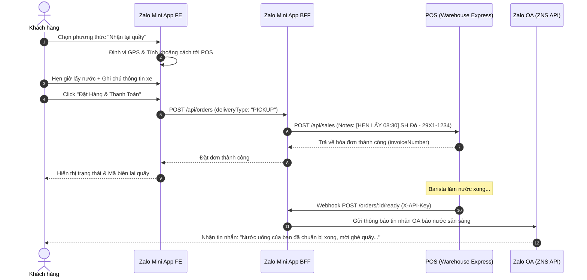

#### Luồng 2: Nghiệp vụ Smart Loyalty Gamification (Đổi hạt cà phê lấy lượt quay)

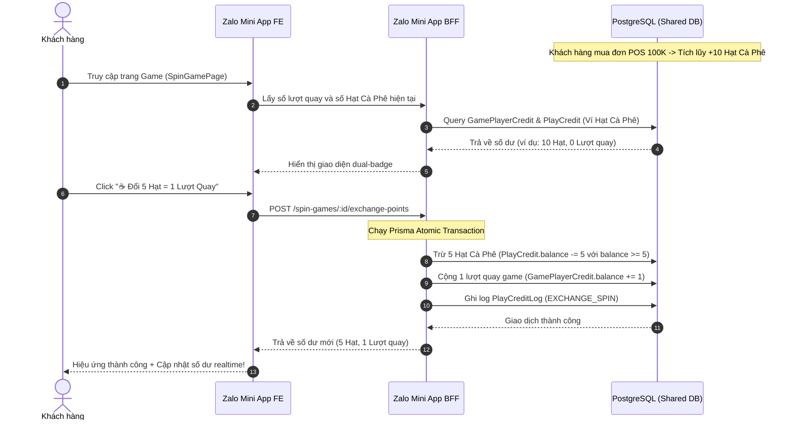

---

## 7. TYPESCRIPT COMPILE STATUS

```
sale-funnel/backend      → npx tsc --noEmit → ✅ PASS (0 errors)
zalo-mini-app/backend    → npx tsc --noEmit → ✅ PASS (0 errors)
zalo-mini-app/frontend   → Build production → ✅ PASS
warehouse-express        → npx tsc --noEmit → ✅ PASS (0 errors thực tế trong src)
```

---

## 8. CHECKLIST TRƯỚC KHI GO-LIVE

### Biến môi trường bắt buộc

```bash
# zalo-mini-app/backend/.env
ZALO_APP_ID=...
ZALO_APP_SECRET=...
JWT_SECRET=...                          # >= 32 ký tự
REDIS_URL=redis://redis:6379/0
DATABASE_URL=postgresql://...
SALE_FUNNEL_BACKEND_URL=http://sale-funnel:10007

# sale-funnel/backend/.env
DATABASE_URL=postgresql://...
REDIS_URL=redis://redis:6379/1
EXPRESSCAFE_BASE_URL=https://your-pos-domain.com
EXPRESSCAFE_API_KEY=...
EXPRESSCAFE_DEFAULT_WAREHOUSE_ID=...
```

### Kiểm tra cuối

- [ ] Whitelist domain API trên **Zalo Mini App Console**
- [ ] Cấu hình Webhook URL trên Nhanh.vn và Haravan trỏ về `https://your-domain.com/api/webhooks/nhanh`
- [ ] Zalo OA đã kết nối và `isActive = true` trong bảng `ZaloOA`
- [ ] Redis port 6379 không exposed ra internet (chỉ internal Docker network)
- [ ] Nginx SSL certificate đã cài đặt và không dùng `localhost` trong `proxy_pass`

---

## 9. ĐỢT 6 — Production Resilience (In Progress)

### Issue Tracker

| Priority | Issue | Status | Files | Chi tiết |
|---|---|---|---|---|
| 🔴 CRITICAL 1 | **Circuit Breaker cho External API** | ✅ DONE | `circuitBreaker.ts`, `expressCafeClient.ts`, `nhanh.ts`, `haravan.ts`, `logger.ts` | CLOSED/OPEN/HALF_OPEN states, threshold 5, recovery 30-60s |
| 🔴 CRITICAL 2 | **Dead Letter Queue cho BullMQ** | ✅ DONE | `dlq.ts`, `orderSyncQueue.ts`, `orderSyncWorker.ts`, `packageOrderWorker.ts`, `admin.ts`, `schema.prisma` | Sau 5 fail → DLQ lưu DB + FATAL log + Zalo OA alert, Admin retry/discard |
| 🔴 CRITICAL 3 | Graceful Shutdown cho Express | ⏳ TODO | `zalo-mini-app/backend/src/index.ts`, `sale-funnel/backend/src/index.ts` | SIGTERM/SIGINT, drain workers, close Prisma/Redis, 30s timeout |
| 🟡 HIGH 1 | Health Check endpoint | ⏳ TODO | Cả 2 backend | `/health/live` + `/health/ready` |
| 🟡 HIGH 2 | Rate Limiting trên Nginx | ⏳ TODO | `nginx.conf` | 30r/s API, 5r/s auth, whitelist internal |
| 🟡 HIGH 3 | Distributed Tracing correlationId | ⏳ TODO | BFF + SF backend | X-Correlation-ID xuyên suốt services |
| 🟢 MEDIUM 1 | Worker concurrency limits | ⏳ TODO | `packageOrderWorker.ts`, `orderSyncWorker.ts` | Per-type concurrency, limiter |
| 🟢 MEDIUM 2 | Worker fail alerting | ⏳ TODO | Workers | 3 fails/5 phút → Zalo OA hoặc FATAL log |

---

### Chi tiết CRITICAL 1: Circuit Breaker (✅ DONE — 2026-05-29)

#### Các Bug Đã Fix (3 Bug Critical)

1. **BUG 1 — HALF_OPEN Cho phép vô số concurrent requests (Thành probe)**
   - **Vấn đề:** Khi circuit chuyển sang `HALF_OPEN`, tất cả các request đến đồng thời đều được cho qua thay vì chỉ một request duy nhất để thăm dò (probe). Nếu có 50 request đến cùng lúc, cả 50 request sẽ bắn vào POS đang hồi phục, gây nguy cơ sập lại.
   - **Giải pháp:** Bổ sung flag `halfOpenProbeInFlight: boolean` vào state. Khi ở trạng thái `HALF_OPEN`, chỉ cho phép đúng 1 request đầu tiên đi qua làm probe request; tất cả các request đến sau trong lúc probe đang xử lý sẽ bị chặn ngay lập tức với lỗi `CircuitBreakerHalfOpenBusyError`.

2. **BUG 2 — Kẹt HALF_OPEN vĩnh viễn khi probe request thất bại**
   - **Vấn đề:** Khi probe request thất bại, circuit kích hoạt `onFailure()` để đưa trạng thái trở lại `OPEN`, nhưng flag `halfOpenProbeInFlight` không được reset về `false` -> chặn vĩnh viễn tất cả các probe request sau đó.
   - **Giải pháp:** Sử dụng block `try...catch...finally` bọc quanh probe request để đảm bảo flag `halfOpenProbeInFlight` luôn được reset về `false` trong mọi trường hợp (dù probe thành công hay thất bại). Đồng thời, khi chuyển trạng thái về `OPEN` hoặc `CLOSED` đều reset flag này.

3. **BUG 3 — Mất trạng thái Circuit Breaker (in-memory) khi restart container**
   - **Vấn đề:** Trạng thái circuit được lưu in-memory nên sẽ mất khi container restart hoặc khi scale horizontal (nhiều bản sao chạy song song không đồng bộ được trạng thái).
   - **Giải pháp:** Đồng bộ hóa trạng thái Circuit Breaker lên Redis thông qua key `cb:state:{name}`:
     - **Lazy-load:** Khởi tạo bất đồng bộ trạng thái từ Redis ở lần gọi `execute()` đầu tiên (do constructor của Circuit Breaker không thể dùng `await`).
     - **Đồng bộ hóa bất đồng bộ (Fire-and-forget):** Lưu trạng thái mới lên Redis sau mỗi lần chuyển đổi với TTL = `recoveryTimeout` + 30s buffer.
     - **Graceful degradation:** Nếu Redis gặp sự cố, hệ thống tự động ghi nhận cảnh báo và fallback về in-memory state, đảm bảo API vẫn chạy bình thường.
     - **Lọc trạng thái:** Khi khởi động, nếu load được trạng thái `HALF_OPEN` từ Redis, tự động hạ cấp về `OPEN` để buộc sinh probe request mới (không khôi phục probe in-flight).

#### Files mới / thay đổi

| File | Loại | Mô tả |
|---|---|---|
| `sale-funnel/backend/src/lib/logger.ts` | **[NEW]** | Pino structured logger singleton, thay toàn bộ `console.*`, redact sensitive fields |
| `sale-funnel/backend/src/lib/circuitBreaker.ts` | **[NEW]** | Circuit Breaker với 3 bug fixes, tích hợp Redis state, hỗ trợ `forceReset` |
| `sale-funnel/backend/src/lib/expressCafeClient.ts` | **[MODIFIED]** | Tích hợp `expressCafeBreaker`, Pino logger, loại bỏ `any` types, typed interfaces |
| `sale-funnel/backend/src/lib/nhanh.ts` | **[MODIFIED]** | Wrap `NhanhClient.request()` bằng `nhanhBreaker`, Pino logger, sửa type lỗi body parameter |
| `sale-funnel/backend/src/lib/haravan.ts` | **[MODIFIED]** | Wrap `HaravanClient.request()` + `haravanExchangeCodeForToken()` bằng `haravanBreaker`, Pino |

#### Circuit Breaker Config

| Service | Breaker Name | Failure Threshold | Recovery Timeout | Request Timeout |
|---|---|---|---|---|
| ExpressCafe POS | `expresscafe-pos` | 5 | 30s | 10s |
| Nhanh.vn API | `nhanh-api` | 5 | 60s | 15s |
| Haravan API | `haravan-api` | 5 | 30s | 12s |

#### State Machine

```
CLOSED ──(5 consecutive failures)──> OPEN ──(30-60s elapsed)──> HALF_OPEN (chỉ 1 probe request đi qua)
  ↑                                                                    │
  └─────────────(2 consecutive successes)─────────────────────────────┘
                    (failure in HALF_OPEN → back to OPEN)
```

#### Sử dụng Admin Reset (force circuit về CLOSED)

```typescript
import { CircuitBreakerRegistry } from './lib/circuitBreaker.js';

// Xem stats toàn bộ các circuits
const stats = CircuitBreakerRegistry.getAllStats();
// { 'nhanh-api': { state: 'OPEN', failures: 5, ... }, ... }

// Force reset 1 circuit (bất đồng bộ do có xoá Redis key)
await CircuitBreakerRegistry.forceReset('nhanh-api');
```

#### Dependencies cài thêm

```bash
# sale-funnel/backend
npm install pino pino-pretty --save
```

---

> **Ghi chú kiến trúc:** Hệ thống sử dụng **Active Cache Invalidation** (xóa cache chủ động) thay vì TTL thụ động cho các thao tác quan trọng như merge tài khoản và cập nhật SĐT — đảm bảo tính nhất quán dữ liệu ngay lập tức, không phụ thuộc vào thời gian hết hạn cache.

---

### Chi tiết CRITICAL 2: Dead Letter Queue (✅ DONE — 2026-05-29)

#### Cơ chế hoạt động

```
BullMQ Job thất bại
  └─ Lần 1-4: Retry tự động (exponential backoff 2s → 4s → 8s → 16s)
  └─ Lần 5 (cuối cùng):
       ├─ Lưu vào bảng DlqJob (PostgreSQL) — bền vững, không mất khi Redis restart
       ├─ Cập nhật Order.status = 'SYNC_FAILED' hoặc PackageOrder.status = 'FAILED'
       ├─ Ghi log FATAL qua Pino logger
       └─ Gửi tin nhắn cảnh báo qua Zalo OA cho Admin (best-effort)
```

#### Files đã tạo / thay đổi

| File | Loại | Mô tả |
|---|---|---|
| `sale-funnel/backend/prisma/schema.prisma` | **[MODIFIED]** | Thêm model `DlqJob` và quan hệ `Account.dlqJobs[]` |
| `sale-funnel/backend/prisma/temp_dlq.sql` | **[NEW]** | Migration SQL tạo bảng `dlq_jobs` với index và foreign key |
| `sale-funnel/backend/src/lib/dlq.ts` | **[NEW]** | Module core: `moveToDlq()`, `extractAccountId()`, `updateOriginalStatus()`, `sendZaloOaAlert()` |
| `sale-funnel/backend/src/queues/orderSyncQueue.ts` | **[MODIFIED]** | Tăng `attempts: 3 → 5`, giảm `removeOnFail: 50 → 10` (DLQ giữ data bền vững) |
| `sale-funnel/backend/src/workers/orderSyncWorker.ts` | **[MODIFIED]** | Failed listener gọi `moveToDlq('ecom-order-sync', ...)`, loại bỏ Sentry dependency |
| `sale-funnel/backend/src/workers/packageOrderWorker.ts` | **[MODIFIED]** | Failed listener gọi `moveToDlq('package-order-queue', ...)`, phân biệt retry/permanent fail |
| `sale-funnel/backend/src/routes/admin.ts` | **[MODIFIED]** | +3 endpoints DLQ: GET list, POST retry, DELETE discard |

#### Schema bảng `dlq_jobs`

```prisma
model DlqJob {
  id           String   @id @default(uuid())
  accountId    String                          // Multi-tenant isolation
  queueName    String                          // 'ecom-order-sync' | 'package-order-queue'
  jobId        String                          // BullMQ Job ID gốc
  jobName      String                          // Tên job gốc
  payload      Json                            // Data đầy đủ để retry
  failedReason String                          // Error message chi tiết
  attemptsMade Int                             // Số lần đã thử
  status       String   @default("ACTIVE")     // ACTIVE | RETRIED | DISCARDED
  retriedAt    DateTime?
  failedAt     DateTime @default(now())
}
```

#### Admin API Endpoints

| Method | Endpoint | Mô tả |
|---|---|---|
| `GET` | `/api/admin/queues/dlq` | Xem danh sách DLQ jobs (có phân trang, filter theo `status`, `queueName`) |
| `POST` | `/api/admin/queues/dlq/:id/retry` | Thử lại — reset trạng thái gốc về PENDING và đẩy lại vào queue |
| `DELETE` | `/api/admin/queues/dlq/:id` | Hủy bỏ — đánh dấu `DISCARDED` vĩnh viễn |

#### TypeScript compile

```bash
npx tsc --noEmit --skipLibCheck  # ✅ 0 errors
```

---

### Đợt 7 — Security Reinforcement & Patches (✅ DONE — 2026-05-29)

Chúng tôi đã triển khai bản vá bảo mật toàn diện cho 5 layer quan trọng của hệ thống nhằm bảo vệ trước các cuộc tấn công bypass thanh toán, timing attacks, bypass tenant isolation và rò rỉ dữ liệu qua log.

| Layer | Lỗ hổng & Rủi ro | Giải pháp Khắc phục | Files Thay đổi |
|---|---|---|---|
| **L4 — Secrets** | **CRITICAL**: Bypass Webhook PayOS trên Production | Ngăn chặn tuyệt đối mock signature và mock payload trên production. Chỉ cho phép bypass mock trong môi trường local development với `PAYOS_MOCK=true`. | `payment.routes.ts` |
| **L4 — Secrets** | **CRITICAL**: Silent fail credentials PayOS | Tích hợp cơ chế fail-fast. Khi khởi chạy backend, nếu đang ở production và thiếu API keys PayOS, hệ thống sẽ log critical error và crash lập tức (`process.exit(1)`). | `payos.ts` |
| **L1 — Auth** | **MEDIUM**: Timing attack kiểm tra mock token | Sử dụng `crypto.timingSafeEqual` thông qua hàm so sánh an toàn `safeCompare` để kiểm tra mock tokens, triệt tiêu timing attack vectors. | `verifyZaloToken.ts` |
| **L1 — Auth** | **MEDIUM**: Hardcoded test Tenant IDs | Loại bỏ các mã UUID tenant hardcode. Chuyển sang đọc động danh sách tenant được phép bypass trong môi trường phát triển qua `DEV_BYPASS_TENANT_IDS`. | `resolveTenant.ts` |
| **L3 — Rate Limit** | **MEDIUM**: Spoofing rate limit customer key | Thay đổi khóa giới hạn lượt tạo đơn. Sử dụng identity đã xác thực (`req.user.id` hoặc `req.customer.id`) kết hợp IP thay vì tin tưởng ID client tự truyền lên. | `rateLimiter.ts` |
| **L5 — Infra & Logs**| **MEDIUM**: Rò rỉ dữ liệu thanh toán qua logs | Loại bỏ hoàn toàn các dòng `console.log` ghi đè raw payload. Thay thế bằng Pino structured logging (`logger.info`), chỉ ghi nhận các mã số giao dịch an toàn. | `payment.routes.ts` |

#### Chi tiết Kỹ thuật Các bản vá

1. **Gia cố Xác thực Webhook PayOS**:
   - Thêm schema validation bằng Zod (`PayOsWebhookSchema`) nhằm kiểm duyệt cấu trúc webhook payload giải mã được từ SDK trước khi xử lý nghiệp vụ hay ghi nhận database.
   - Bất kỳ webhook request nào chứa `isMock: true` hoặc signature `'mock_signature'` trên Production sẽ bị từ chối với mã `403 Forbidden` ngay lập tức.

2. **So sánh Timing-Safe**:
   - Hàm `safeCompare(a, b)` chuyển đổi string sang `Buffer` và kiểm tra độ dài. Nếu trùng khớp độ dài, gọi hàm so sánh thời gian thực `crypto.timingSafeEqual` để loại trừ hoàn toàn Timing Side-channel attacks.

3. **Structured Logging An toàn**:
   - Chuyển đổi mọi cuộc gọi log cũ sang Pino logger với correlation ID tích hợp:
     ```typescript
     logger.info({ action: 'PAYOS_WEBHOOK_VERIFIED', orderCode: String(cleanData.orderCode) }, 'PayOS Webhook success');
     ```